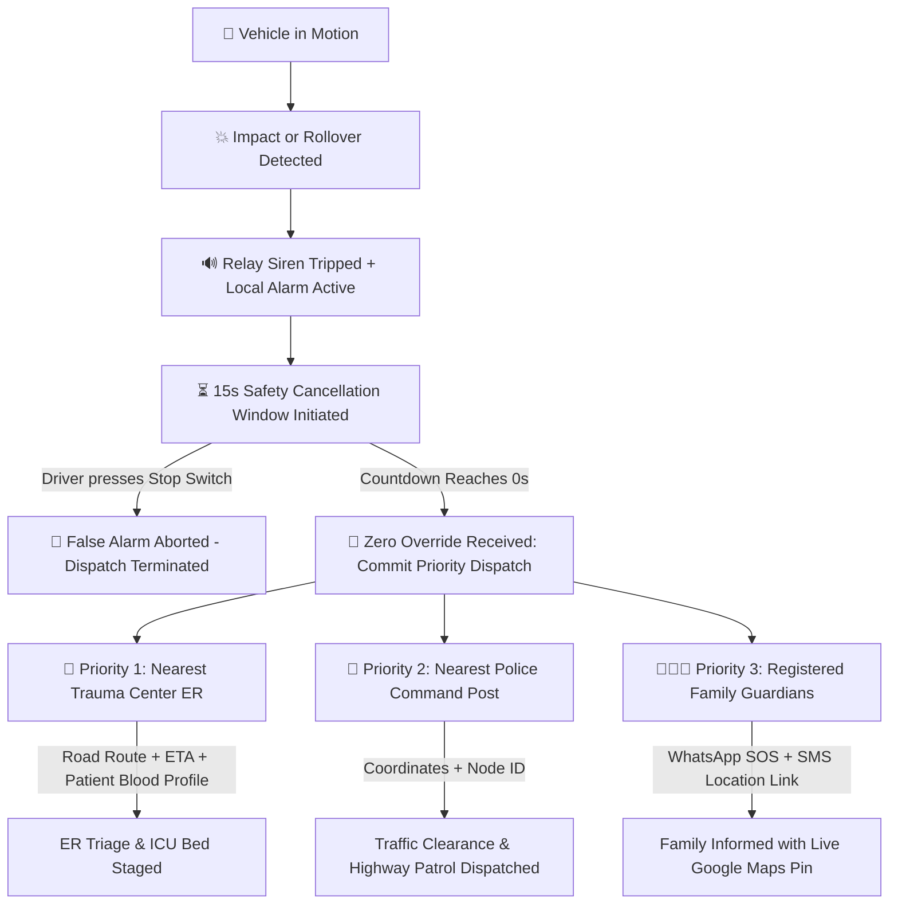

# 🚨 ASAAS — Automated System for Accident Alert & Safety

[](https://vitejs.dev/)
[](https://reactjs.org/)
[](https://leafletjs.com/)
[](https://project-osrm.org/)
[](https://espressif.com/)
[](#)

> **ASAAS (Automated System for Accident Alert & Safety)** is an intelligent, IoT-integrated vehicular accident detection, live telemetry tracking, and multi-tier priority emergency response platform. It autonomously senses collision impacts and vehicle rollovers, provides a driver safety cancellation window to avoid false alarms, and dispatches automated priority alerts to the nearest Trauma Hospitals, Police Stations, and registered Emergency Family Guardians.

---

## 📌 Table of Contents
- [Key Features](#-key-features)
- [Emergency Dispatch Workflow (Hospital → Police → Family)](#-emergency-dispatch-workflow)
- [System Architecture](#-system-architecture)
- [Hardware Node Specifications](#-hardware-node-specifications)
- [Project Directory Structure](#-project-directory-structure)
- [Getting Started](#-getting-started)
- [Live Telemetry & API Hub](#-live-telemetry--api-hub)
- [Multi-Device Responsiveness](#-multi-device-responsiveness)
- [Academic Viva & Evaluation Guide](#-academic-viva--evaluation-guide)

---

## 🌟 Key Features

### 1. 💥 Autonomous Accident & Rollover Detection
- **MPU6050 6-Axis Accelerometer & Gyroscope**: Continuous 100Hz sensing measuring 3-axis deceleration ($G_x, G_y, G_z$) and angular roll/pitch tilt.
- **Dual-Threshold Trigger**:
  - High-impact collision trigger ($> 4.0\text{g}$ dynamic impulse).
  - Rollover crash trigger (Gyroscope roll angle $> 85^\circ$).

### 2. ⏳ Safety Cancellation Window & Hardware Circuit Breaker
- **15-Second Abort Countdown**: Gives conscious occupants time to cancel minor fender-benders or dropped devices before triggering public emergency services.
- **Physical Stop Switch Simulation**: Immediate circuit interruption that silences the local relay siren and aborts outbound dispatch.
- **Audio Warning Siren**: Synthesized real-time dual-tone emergency buzzer using the HTML5 Web Audio API.

### 3. 🏥 3-Tier Priority Emergency Dispatch Pipeline
1. **Tier 1 — Nearest Trauma Center ER**: Dispatches patient blood group, medical allergy dossier, exact GPS coordinates, ICU bed requirements, and live OSRM road route.
2. **Tier 2 — Nearest Police Jurisdiction**: Notifies law enforcement control room for traffic clearance, route escort, and accident site perimeter securing.
3. **Tier 3 — Family & Emergency Guardians**: Instant WhatsApp location broadcast (`wa.me`) and automated SMS text transmission.

### 4. 🗺️ Live Leaflet Map with Real OSRM Shortest Road Routing
- Real-time Haversine distance calculations filtering emergency facilities within 5km, 10km, and 20km radii.
- **OSRM (Open Source Routing Machine)** road geometry integration plotting real street routes (not simple straight lines) with accurate turn-by-turn road distance and real-time vehicular ETA.
- Interactive floating Route HUD auto-bounded for mobile and desktop screens.

### 5. 🩺 Emergency Medical Care & Paramedic Dossier
- Complete medical identity: Blood group, severe allergies, chronic conditions, regular prescriptions, emergency contact numbers, and organ donor registry ID.
- **High-Contrast Paramedic Mode**: One-tap high-visibility triage card tailored for 108 ambulance paramedics.

### 6. 🚗 Vehicle Garage & Digital Document Vault
- Multi-vehicle registration management with ESP32 hardware device ID pairing.
- Expiry date tracker for Registration Certificate (RC), Motor Insurance, Pollution Under Control (PUC), and Driving License with automated color-coded alerts.

### 7. 🧠 AI Collision Severity & Vector Reconstruction
- Neural collision severity index ($0 - 100$) derived from multi-axis impulse curves.
- Exportable official AI Diagnostic Incident PDF report for insurance, legal, and hospital triage use.

---

## 🚨 Emergency Dispatch Workflow



---

## 🛠️ Hardware Node Specifications

| Component | Hardware Model | Interface | Function in ASAAS |
| :--- | :--- | :--- | :--- |
| **Microcontroller** | ESP32 NodeMCU / ESP-WROOM-32 | Wi-Fi / BLE / UART | Core IoT processing, JSON payload packaging, REST telemetry transmission |
| **Crash & Tilt Sensor**| MPU6050 6-Axis IMU | I2C (`SDA: GPIO 21`, `SCL: GPIO 22`) | Deceleration impact ($g$) and vehicle roll/pitch angle detection |
| **Satellite Positioning**| NEO-6M GPS Receiver | UART (`TX: GPIO 16`, `RX: GPIO 17`) | Real-time latitude, longitude, speed (km/h), and satellite lock |
| **Cellular Communicator**| SIM800L GSM/GPRS Module | UART (`TX: GPIO 26`, `RX: GPIO 27`) | Fallback SMS alert and cellular telemetry transmission |
| **Local Siren Alert** | 5V Single-Channel Relay Module | Digital Out (`GPIO 25`) | Controls vehicle horn / high-decibel piezobuzzer |
| **Circuit Breaker** | Momentary Push Button | Digital In Pull-Up (`GPIO 33`) | Driver emergency cancellation switch |

---

## 📁 Project Directory Structure

```text
Asaas/
├── index.html                     # HTML5 entry with responsive viewport & meta tags
├── package.json                   # Project dependencies and build scripts
├── vercel.json                    # Vercel SPA deployment configuration
├── vite.config.js                 # Vite bundler configuration with CORS & proxy
├── PRESENTATION_AND_VIVA_GUIDE.md # Complete viva defense & presentation master guide
├── README.md                      # Comprehensive project documentation
├── src/
│   ├── App.jsx                    # Root state controller & responsive layout
│   ├── main.jsx                   # React DOM entrypoint
│   ├── index.css                  # Bespoke emergency dispatch design system & responsive CSS
│   ├── components/
│   │   ├── Navbar.jsx             # Top bar with hamburger menu, vehicle switcher & SOS button
│   │   ├── Sidebar.jsx            # Dual-mode desktop sidebar & mobile slide-out drawer
│   │   ├── TelemetryBar.jsx       # Horizontal momentum-scrolling hardware metrics ticker
│   │   ├── Dashboard/
│   │   │   └── DashboardTab.jsx   # Live telemetry gauges, test deck & collision simulation
│   │   ├── Emergency/
│   │   │   └── EmergencySosModal.jsx # Priority dispatch modal with Web Audio siren
│   │   ├── Map/
│   │   │   ├── AccidentMapTab.jsx # Live Leaflet accident tracking map & OSRM route
│   │   │   └── PersonalHospitalMapTab.jsx # Nearest hospital/police locator with filters
│   │   ├── Medical/
│   │   │   └── MedicalCareTab.jsx # Emergency medical profile & paramedic high-contrast view
│   │   ├── Vehicles/
│   │   │   └── VehicleManagerTab.jsx # Vehicle registration & digital document vault
│   │   ├── Contacts/
│   │   │   └── EmergencyContactsTab.jsx # Guardian roster with WhatsApp & SMS SOS
│   │   ├── AIAnalysis/
│   │   │   └── AiAnalysisTab.jsx  # AI collision severity curves & PDF report exporter
│   │   ├── Architecture/
│   │   │   └── ArchitectureTab.jsx # Interactive interactive system dataflow schematic
│   │   └── ApiHub/
│   │   │   └── Esp32ApiHubTab.jsx # JSON telemetry sandbox & ready-to-flash Arduino firmware
│   └── services/
│       ├── geoService.js          # Haversine distance algorithm & OSRM road route fetching
│       ├── mockData.js            # Initial vehicles, hospitals, police stations & contacts
│       └── telemetryEngine.js     # Physics simulation engine for speed, g-force & tilt
```

---

## 🚀 Getting Started

### Prerequisites
- [Node.js](https://nodejs.org/) version `18.0` or higher
- [npm](https://www.npmjs.com/) (bundled with Node.js)

### 1. Clone the Repository
```bash
git clone https://github.com/Aaradhya062007/Asaas.git
cd Asaas
```

### 2. Install Dependencies
```bash
npm install
```

### 3. Run Development Server
```bash
npm run dev
```
The application will launch locally at `http://localhost:5173`.

### 4. Build for Production
```bash
npm run build
```
The optimized, minified production assets will be generated in the `dist/` directory.

---

## 🔌 Live Telemetry & API Hub

The platform supports integration with real hardware through REST and WebSocket endpoints:

### Inbound Sensor Telemetry Payload Specification
```http
POST /api/v1/telemetry
Content-Type: application/json

{
  "espDeviceId": "ESP32-ASAAS-NODE-01",
  "vehicleReg": "HR26-DK-8392",
  "lat": 28.45950,
  "lng": 77.02660,
  "speedKmh": 64.2,
  "accelX": 0.12,
  "accelY": -0.05,
  "accelZ": 0.98,
  "totalGForce": 0.99,
  "pitchDeg": 1.2,
  "rollDeg": -0.8,
  "impactDetected": false,
  "rolloverDetected": false,
  "batteryPercent": 94,
  "batteryVoltage": "12.6V",
  "gpsSatellites": 12,
  "gsmSignalDbm": -68
}
```

A complete, ready-to-flash Arduino C++ firmware sketch (`.ino`) is available in the **ESP32 API Hub** tab within the dashboard.

---

## 📱 Multi-Device Responsiveness

ASAAS is engineered from the ground up to provide a native application feel across all form factors:
- **Mobile Phones (360px – 480px)**: Slide-out drawer navigation, sticky 1-tap horizontal tab strip, vertical-stacking priority responder cards, and touch-scrolling telemetry bars.
- **Tablets & iPads (768px – 1024px)**: Adaptive grid layouts, responsive Leaflet map heights (`clamp(380px, 55vh, 520px)`), and auto-bounded floating route HUDs.
- **Desktops & Laptops (1025px+)**: Dual-pane split layouts, fixed hardware node sidebar, and real-time telemetry streaming consoles.

---

## 🎓 Academic Viva & Evaluation Guide

For university project viva defenses, teacher reviews, and evaluation presentations, refer to the complete guide:
📄 **[`PRESENTATION_AND_VIVA_GUIDE.md`](./PRESENTATION_AND_VIVA_GUIDE.md)**

It covers:
- The 1-minute elevator pitch
- Answers to tricky examiner questions (false positive mitigation, network blind spots, power loss handling)
- 5-step live demonstration script
- Future scope & production roadmap

---

## 📄 License
Developed for Academic Project Evaluation & Research under the **ASAAS Initiative**.
