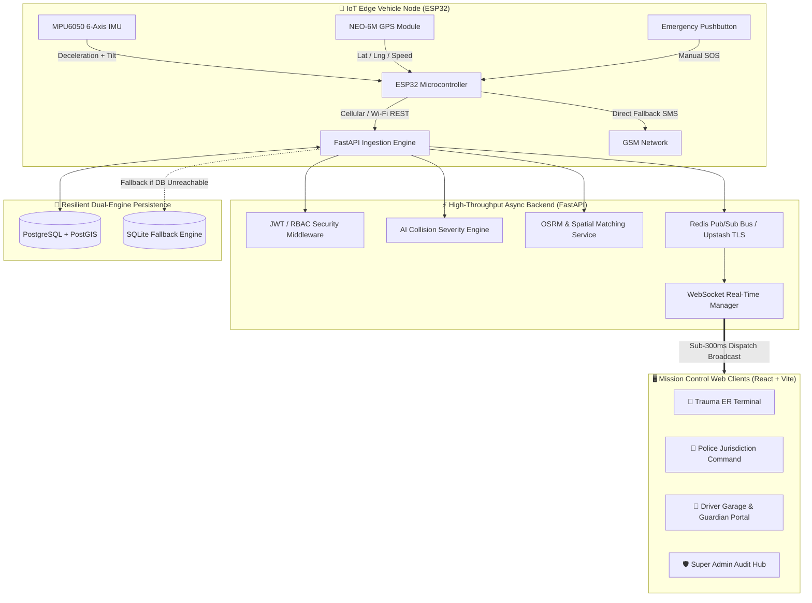
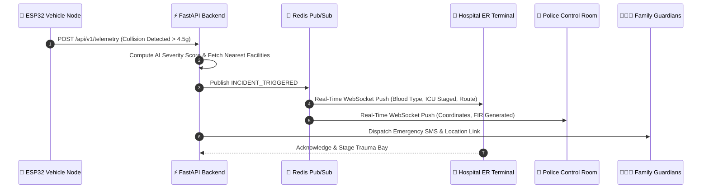

# 🚨 ASAAS — Automated System for Accident Alert & Safety (v2.0)

[](https://fastapi.tiangolo.com/)
[](https://python.org/)
[](https://www.postgresql.org/)
[](https://redis.io/)
[](https://reactjs.org/)
[](https://vitejs.dev/)
[](https://www.docker.com/)

> **ASAAS (Automated System for Accident Alert & Safety)** is an end-to-end, IoT-connected vehicular accident detection, live telemetry streaming, and multi-tier emergency dispatch platform. It autonomously detects collisions and vehicle rollovers in real time, provides a conscious-driver safety cancellation window to eliminate false alarms, and coordinates instantaneous, deterministic emergency dispatching across Trauma Hospitals, Police Jurisdictions, and Family Guardians.

---

## 📌 Table of Contents
- [System Architecture](#-system-architecture)
- [Key Features](#-key-features)
- [Multi-Tier Emergency Dispatch Flow](#-multi-tier-emergency-dispatch-flow)
- [Hardware Node Specifications (IoT)](#-hardware-node-specifications-iot)
- [Technology Stack](#-technology-stack)
- [Project Directory Structure](#-project-directory-structure)
- [Getting Started & Local Development](#-getting-started--local-development)
- [Docker Production Deployment](#-docker-production-deployment)
- [Cloud Production Deployment](#-cloud-production-deployment)
- [API Reference & IoT Hub](#-api-reference--iot-hub)
- [Role-Based Access Control (RBAC)](#-role-based-access-control-rbac)
- [License](#-license)

---

## 🏛️ System Architecture



---

## 🌟 Key Features

### 1. 💥 Autonomous Collision & Rollover Sensation
- **Continuous 100Hz Sensing**: Tracks 3-axis kinetic acceleration ($G_x, G_y, G_z$) and angular roll/pitch tilt.
- **Dual-Threshold Trigger**:
  - High-impact collision trigger ($> 4.0\text{g}$ dynamic impulse).
  - Rollover crash trigger (Gyroscope tilt angle $> 85^\circ$).

### 2. 🧠 AI Collision Severity & Vector Reconstruction
- **Kinetic Impulse Severity Index ($0 - 100$)**: Computed dynamically from vehicle mass, impact velocity, and vector magnitude.
- **Triage Intelligence**: Generates diagnostic crash profiles for incoming trauma surgeons and provides casualty risk indicators.

### 3. ⏳ 15-Second Safety Abort Window
- **False-Alarm Mitigation**: Gives conscious vehicle occupants 15 seconds to abort non-critical fender benders before public emergency responders are notified.
- **Synthesized Audio Alarm**: Dual-tone emergency siren generated through the HTML5 Web Audio API.

### 4. 🏥 Deterministic 3-Tier Multi-Agency Dispatch
1. **Tier 1 — Nearest Trauma Center ER**: Automatically reserves ICU beds, prepares compatible blood units based on driver ABHA dossier, and transmits real-time road routes.
2. **Tier 2 — Nearest Police Station**: Auto-generates electronic FIR draft, activates green corridor routing, and details accident coordinates.
3. **Tier 3 — Family Guardians**: Dispatches automated SMS alerts and WhatsApp SOS links with live Google Maps pins.

### 5. 🗺️ Live Spatial Mapping & Real OSRM Road Routing
- Real-time Haversine distance spatial queries.
- **Open Source Routing Machine (OSRM)** integration plotting street navigation routes with turn-by-turn road distance and traffic-adjusted vehicular ETA.

### 6. 🛡️ Enterprise Security & Dual-Engine Persistence
- **Dual-Engine DB Architecture**: Automatically utilizes PostgreSQL + PostGIS when available, with automatic zero-configuration SQLite fallback.
- **Redis Pub/Sub Bus**: Leverages cloud Redis (Upstash TLS) for low-latency event distribution with built-in in-memory fallback.
- **JWT & Role-Based Access Control**: Strict privilege separation for hospital staff, police officers, vehicle owners, and administrators.

---

## 🚨 Multi-Tier Emergency Dispatch Flow



---

## 🛠️ Hardware Node Specifications (IoT)

| Component | Hardware Model | Interface | Function in ASAAS |
| :--- | :--- | :--- | :--- |
| **Microcontroller** | ESP32 NodeMCU / ESP-WROOM-32 | Wi-Fi / BLE / UART | Edge processing, JSON payload packaging, REST telemetry |
| **IMU Sensor** | MPU6050 6-Axis Gyroscope | I2C (`SDA: GPIO 21`, `SCL: GPIO 22`) | Deceleration impact ($g$) and vehicle roll/pitch angle detection |
| **GPS Receiver** | NEO-6M GPS Module | UART (`TX: GPIO 16`, `RX: GPIO 17`) | Real-time latitude, longitude, speed, and satellite lock |
| **Cellular Modem** | SIM800L GSM/GPRS Module | UART (`TX: GPIO 26`, `RX: GPIO 27`) | Fallback SMS alert and cellular telemetry transmission |
| **Local Siren** | 5V Relay Module + Buzzer | Digital Out (`GPIO 25`) | In-cabin audible collision alert |
| **Abort Switch** | Momentary Pushbutton | Digital In Pull-Up (`GPIO 33`) | Driver emergency cancellation switch |

---

## 💻 Technology Stack

### Backend & Cloud Infrastructure
- **Core Framework**: Python 3.11+, FastAPI, Uvicorn (ASGI)
- **Database Engine**: PostgreSQL + PostGIS / SQLite (`aiosqlite`) via SQLAlchemy 2.0 Async ORM
- **Event Bus**: Redis (`redis.asyncio` with TLS support for Upstash)
- **Authentication**: JWT (JSON Web Tokens) with passlib bcrypt hashing
- **Geospatial & Routing**: OSRM (Open Source Routing Machine) + Haversine Vector Math
- **External Communications**: Twilio SMS API & MQTT Hardware Bridge

### Frontend Client
- **Framework**: React 18 with Vite
- **Mapping & GIS**: Leaflet & React-Leaflet
- **Data Visualization**: Chart.js & React-Chartjs-2
- **Icons & Design**: Lucide Icons, Glassmorphism CSS design system

---

## 📁 Project Directory Structure

```text
Asaas/
├── backend/                       # Production FastAPI Asynchronous Backend
│   ├── Dockerfile                 # Multi-stage container definition
│   ├── requirements.txt           # Python dependencies
│   ├── app/
│   │   ├── main.py                # FastAPI entrypoint, lifespan, CORS & WebSockets
│   │   ├── core/                  # Database engines, Redis bus, security & config
│   │   ├── models/                # SQLAlchemy ORM models (Incident, Vehicle, Hospital, etc.)
│   │   ├── schemas/               # Pydantic validation schemas
│   │   ├── services/              # AI severity calculation, GIS routing, SMS dispatch
│   │   └── api/v1/                # Modular REST route controllers
│   └── database/
│       └── seed.py                # Database population script (facilities, demo accounts)
├── src/                           # React 18 Frontend Application
│   ├── App.jsx                    # Root view controller & navigation state
│   ├── components/                # Specialized command terminals & user interfaces
│   │   ├── Dashboard/             # Live sensor telemetry HUD & test crash deck
│   │   ├── Emergency/             # Priority dispatch countdown modal & Web Audio siren
│   │   ├── Hospital/              # Trauma ER dashboard & ICU bed manager
│   │   ├── Map/                   # GIS accident map & turn-by-turn road route
│   │   ├── Medical/               # ABHA digital medical health record
│   │   ├── Vehicles/              # Digital vehicle garage & document vault
│   │   ├── Guardian/              # Emergency contact roster & guardian portal
│   │   ├── AIAnalysis/            # Collision vector diagnostics & PDF report exporter
│   │   └── ApiHub/                # Hardware firmware (.ino) & REST telemetry sandbox
│   └── services/
│       ├── apiClient.js           # Axios/Fetch API client with auth interceptors
│       ├── cloudDbEngine.js       # Live state synchronization engine
│       └── liveSocket.js          # Resilient WebSocket connection manager
├── docker-compose.yml             # Full-stack multi-container composition
├── Dockerfile.frontend            # Production Nginx frontend image build
├── nginx.conf                     # Reverse proxy for React SPA, API, and WebSockets
├── render.yaml                    # Production 1-click cloud configuration
├── vercel.json                    # Vercel SPA routing rewrite specification
└── package.json                   # Frontend dependencies and build scripts
```

---

## 🚀 Getting Started & Local Development

### 1. Clone the Repository
```bash
git clone https://github.com/ItzNitish01/Asaas_1.2.git
cd Asaas_1.2
```

### 2. Backend Setup
```bash
cd backend
python -m venv venv

# Windows
.\venv\Scripts\activate
# Linux/macOS
source venv/bin/activate

pip install -r requirements.txt
```

#### Configure Environment Variables
Copy `.env.example` to `.env`:
```bash
cp .env.example .env
```
*(Leave `DATABASE_URL` and `REDIS_URL` blank to run with zero-setup SQLite and in-memory pub/sub fallbacks, or connect to Neon PostgreSQL and Upstash Redis).*

#### Seed Demo Facilities & Accounts
```bash
python -m database.seed
```

#### Start FastAPI Backend
```bash
uvicorn app.main:app --port 5000 --reload
```
The API is live at `http://localhost:5000` (Interactive Swagger Docs: `http://localhost:5000/docs`).

### 3. Frontend Setup
In a separate terminal window:
```bash
# In project root
npm install
npm run dev
```
Open `http://localhost:5173` in your browser.

---

## 🐳 Docker Production Deployment

Run the complete full-stack environment with a single command:
```bash
docker-compose up -d --build
```
This deploys:
- **FastAPI Backend**: `http://localhost:5000`
- **React Frontend (Nginx)**: `http://localhost:80`
- **PostgreSQL + PostGIS**: `localhost:5432`
- **Redis Alpine**: `localhost:6379`

---

## ☁️ Cloud Production Deployment

- **Backend (Render / Railway / Fly.io)**:
  - Root directory: `backend`
  - Build command: `pip install -r requirements.txt`
  - Start command: `uvicorn app.main:app --host 0.0.0.0 --port $PORT`
  - Pre-configured [`render.yaml`](./render.yaml) provided for instant deployment.
- **Frontend (Vercel / Netlify / Cloudflare Pages)**:
  - Root directory: `./`
  - Build command: `npm run build`
  - Output directory: `dist`
  - Pre-configured [`vercel.json`](./vercel.json) handles client-side SPA routing rewrites.

---

## 🔌 API Reference & IoT Hub

The backend exposes a high-throughput, async REST API and bi-directional WebSocket interface documented interactively via OpenAPI / Swagger at `http://localhost:5000/docs`.

### 1. Inbound IoT Telemetry Specification (`POST /api/v1/telemetry`)
Microcontrollers (ESP32, Raspberry Pi, Arduino with GSM/Wi-Fi) push sensor telemetry packets every 500ms–1000ms. If peak deceleration exceeds **4.0g** or rollover tilt exceeds **85°**, the backend autonomously triggers a critical incident.

#### Request Payload
```http
POST /api/v1/telemetry
Content-Type: application/json

{
  "device_id": "ESP32-ASAAS-01",
  "api_key": "optional_pre_shared_device_key",
  "speed_kmh": 68.4,
  "accel_x": 0.15,
  "accel_y": -0.08,
  "accel_z": 4.82,
  "total_g": 4.82,
  "pitch_deg": 4.1,
  "roll_deg": -1.2,
  "gps": {
    "lat": 28.4595,
    "lng": 77.0266,
    "sats": 9
  },
  "battery_percent": 95,
  "gsm_dbm": -65,
  "sos_button": "RELEASED"
}
```

#### Response Payload
```json
{
  "status": "OK",
  "message": "Telemetry processed",
  "emergency_triggered": true,
  "incident_id": "INC-20260915-7A9B"
}
```

---

### 2. Real-Time WebSocket Protocol (`ws://localhost:5000/ws`)
Emergency operations centers, trauma bay terminals, and police dispatchers maintain persistent WebSocket channels for sub-300ms event distribution.

- **Connection URL**: `ws://localhost:5000/ws?role={ROLE}&token={JWT_TOKEN}`
- **Heartbeat**: Send `"ping"`, server replies `{"type":"pong"}`.
- **Broadcast Events**:
  | Event Channel | Payload Description | Target Audience |
  |---|---|---|
  | `TELEMETRY_STREAM` | Live vehicle GPS coordinates, speed, G-force, and tilt vector | Vehicle Garage & Admin Fleet Map |
  | `INCIDENT_TRIGGERED` | Crash impact data, AI severity score, patient ABHA dossier, and nearest hospital/police routes | Trauma ER, Police Control, Guardians |
  | `INCIDENT_ABORTED` | Driver-confirmed false alarm cancellation notification | All Connected Responders |
  | `DISPATCH_UPDATE` | Ambulance en-route ETA, ICU bed reservation, and PCR status changes | Active Incident Handlers |

---

### 3. Core REST API Endpoints

#### Authentication & Identity
| Method | Endpoint | Access | Description |
|---|---|---|---|
| `POST` | `/api/v1/auth/login` | Public | Authenticates username/password; returns JWT access token and sets HttpOnly cookie |
| `POST` | `/api/v1/auth/register` | Public | Self-onboarding for new vehicle owners |
| `GET` | `/api/v1/auth/me` | Authenticated | Retrieves current authenticated user profile and active role |

#### Telemetry & IoT
| Method | Endpoint | Access | Description |
|---|---|---|---|
| `POST` | `/api/v1/telemetry` | IoT / Public | Ingests sensor packet; calculates total G-force and evaluates crash thresholds |
| `GET` | `/api/v1/telemetry/recent` | Authenticated | Returns the last 50 telemetry packets logged for the user's vehicles |

#### Emergency Incidents & Dispatch
| Method | Endpoint | Access | Description |
|---|---|---|---|
| `POST` | `/api/v1/incidents/trigger` | Authenticated / IoT | Manually or programmatically triggers an emergency incident |
| `POST` | `/api/v1/incidents/abort` | Authenticated | Cancels an active incident during the 15-second safety window |
| `GET` | `/api/v1/incidents/active` | Public / Responders | Returns the currently active emergency incident and dispatch status |
| `GET` | `/api/v1/incidents/all` | `SUPER_ADMIN` | Comprehensive historical audit trail of all recorded incidents |

#### Spatial Facilities & Jurisdictions
| Method | Endpoint | Access | Description |
|---|---|---|---|
| `GET` | `/api/v1/hospitals/all` | Public / Responders | Returns all registered trauma hospitals with live ICU bed and blood bank statuses |
| `GET` | `/api/v1/hospitals/nearest` | Public / Responders | Geospatial k-NN query returning nearest trauma centers sorted by road distance/ETA |
| `GET` | `/api/v1/police/all` | Public / Responders | Returns all regional police command stations and patrol interceptor counts |
| `GET` | `/api/v1/police/nearest` | Public / Responders | Geospatial query returning nearest police stations to a specific GPS coordinate |

#### Registry & Profiles
| Method | Endpoint | Access | Description |
|---|---|---|---|
| `GET` / `POST` | `/api/v1/registry/vehicles` | `VEHICLE_OWNER` / Admin | Lists or registers vehicles and pairs hardware device IDs |
| `GET` / `PUT` | `/api/v1/registry/medical` | `VEHICLE_OWNER` / Admin | Reads or updates the driver's ABHA emergency medical card |
| `GET` / `POST` | `/api/v1/registry/contacts` | `VEHICLE_OWNER` / Admin | Manages emergency family guardian contact numbers for SMS/WhatsApp alerts |

#### System Health
| Method | Endpoint | Access | Description |
|---|---|---|---|
| `GET` | `/api/health` | Public | Returns service status, active WebSocket connection count, and server UTC timestamp |

---

## 👥 Role-Based Access Control (RBAC)

ASAAS enforces strict privilege separation via **JSON Web Tokens (HS256)** and FastAPI dependency injection. Authentication tokens are accepted via the `Authorization: Bearer <token>` header as well as secure `HttpOnly` browser cookies.

### 1. Access Permission Matrix

| Capability / Operational Surface | `SUPER_ADMIN` | `HOSPITAL_ER` | `POLICE_CONTROL` | `VEHICLE_OWNER` | `GUARDIAN_PUBLIC` |
|---|:---:|:---:|:---:|:---:|:---:|
| **Vehicle Telemetry Streaming** | Full Fleet | Incident Only | Incident Only | Owned Vehicles | Assigned Vehicle |
| **Trauma ER Dashboard & ICU Bed Staging** | View | Full Control | Read-Only | - | - |
| **Police PCR Dispatch & Green Corridor** | View | Read-Only | Full Control | - | - |
| **Electronic FIR Generation** | Audit | - | Create / Sign | - | - |
| **ABHA Medical Card Access** | Full Audit | Read-Only | - | Full Control | Emergency View |
| **Emergency Guardian Roster Management** | Full Audit | Read-Only | - | Full Control | View / Verify |
| **Global Incident History Audit** | Full Control | Assigned | Assigned | Personal | Family Circle |
| **Multi-Agency Command Terminal Jump** | Full Control | - | - | - | - |
| **System Health & Gateway Configuration** | Full Control | - | - | - | - |

---

### 2. Pre-Configured Demonstration Accounts

All demo accounts are pre-seeded in the Neon PostgreSQL database with bcrypt-hashed passwords. Users can log in using either their **Username or Email Address**:

| Role | Username | Email | Password | Default Workspace View |
|---|---|---|---|---|
| **SUPER_ADMIN** | `admin` | `admin@asaas.gov.in` | `Admin@1234` | **Master System Audit & Fleet Control** (`admin-audit`) |
| **HOSPITAL_ER** | `hospital_er` | `er@aiims.ac.in` | `Hospital@1234` | **Trauma ER Terminal & ICU Bed Bay** (`hospital-terminal`) |
| **POLICE_CONTROL** | `police_ctrl` | `pcr@delhipolice.gov.in` | `Police@1234` | **Highway PCR Command Interceptor** (`police-command`) |
| **VEHICLE_OWNER** | `vehicle_owner` | `owner@example.com` | `Owner@1234` | **Driver Cockpit & Telemetry Deck** (`dashboard`) |
| **GUARDIAN_PUBLIC** | `guardian_user` | `guardian@example.com` | `Guardian@1234` | **Family Safety Portal & Trip Radar** (`guardian-portal`) |

> [!TIP]
> Logging in with any account automatically transitions the web dashboard to that role's specialized workspace with zero manual navigation required. Super Admins possess root visibility and can hot-swap into any agency terminal directly from the top navigation or sidebar. In production, rotate all default credentials using the `/api/v1/auth` endpoints.

---

## 📄 License
Developed for research and real-world deployment under the **ASAAS Emergency Response Initiative**.
All rights reserved.
